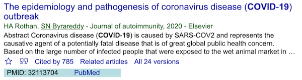

# Find PMID

_Find PMID_ is a Google Chrome extension that uses Entrez Programming Utilities (E-utilities) to find PMID (unique identifier used in PubMed), displays PMID, and provides one click access to the article page in PubMed for Google Scholar's results.

## Note

An API key is required and can be obtained from [NCBI](https://www.ncbi.nlm.nih.gov/) account >> Settings >> API Key Management.